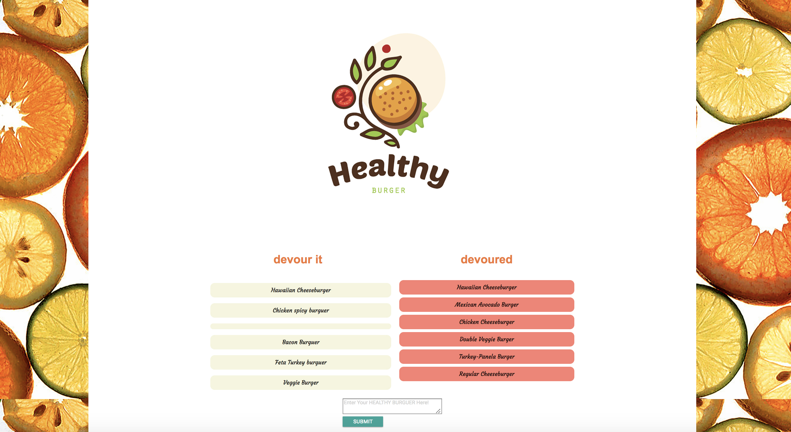

# burger
##Overview

*Healthy burger, is a menu application (game) that let user to input name of burgers they would like to eat. 

*The burger will show ready to be devour, if the user wants to Devour it clicks on the button wich has the burger name and this one will show on the side which says Devoured!

*This applicacion stores each hamburger in the database.

## Author

**Reyna Perez**

## Acknowledgments

*UA Programing Bootcamp
